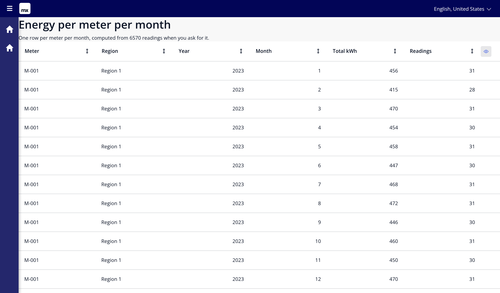
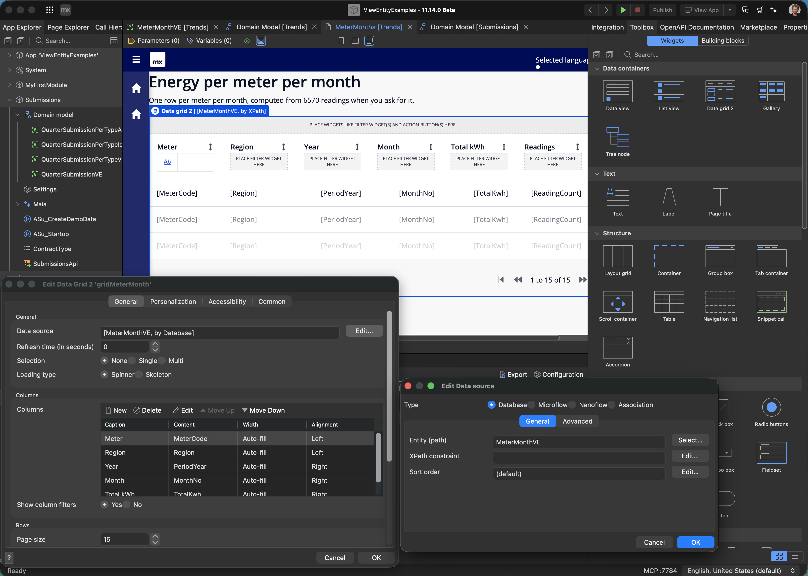
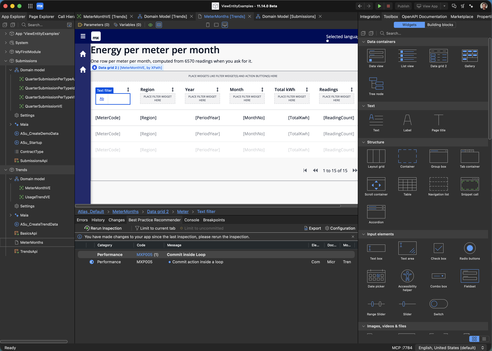

# 6. What a view entity is — from zero

The companion to [film 3](../video/view-entities-101.mp4). Everything here was
captured from the app in this repository, running on Mendix 10.24.24.119653
against PostgreSQL 16.

## The question

`Trends` holds 6 meters and 1095 daily readings each — **6570 rows**. Nobody
stored a monthly total, so answering *"how much energy did each meter use, per
month?"* means working it out. The only real choice is **where**: in the app,
by retrieving 6570 objects and looping; or in the database, by asking for the
216 totals and getting back 216 rows.

A view entity is the second one, written down and given a name.

## The view entity

[`mdl/20-basics-view.mdl`](../mdl/20-basics-view.mdl):

```sql
create or modify view entity Trends.MeterMonthVE (
  MeterCode: String(20), Region: String(40), PeriodYear: Integer,
  MonthNo: Integer, TotalKwh: Decimal, ReadingCount: Integer
) as (
  select m.MeterCode as MeterCode, m.Region as Region
  ,      datepart(YEAR, r.ReadAt) as PeriodYear
  ,      datepart(MONTH, r.ReadAt) as MonthNo
  ,      sum(r.Kwh) as TotalKwh, count(r.ID) as ReadingCount
  from   Trends.Reading as r
    inner join r/Trends.Reading_Meter/Trends.Meter as m
  group by m.MeterCode, m.Region,
           datepart(YEAR, r.ReadAt), datepart(MONTH, r.ReadAt)
);
```

Nothing is stored. There is no copy to keep in sync, and no copy that can go
stale: every read is answered from the tables as they are at that moment.

`group by` enforces one rule — **every column in the select list is either a
grouping key or an aggregate**. There is no third kind; `r.Kwh` on its own has
no answer, because a group holds thirty of them.

216 rows come back: 6 meters × 36 months.

## As a page datasource

[`mdl/21-basics-page.mdl`](../mdl/21-basics-page.mdl) puts a data grid straight
on it — `DataSource: DATABASE Trends.MeterMonthVE`, page size 15. No microflow,
no list variable.



And the same page in the editor, where the datasource is set — `Type: Database`,
`Entity (path): MeterMonthVE`, nothing in between:



What the grid then does is the point
([`sql/08-grid-retrieve.sql`](sql/08-grid-retrieve.sql), captured with
`ConnectionBus_Retrieve` at TRACE):

| the user does | the SQL gains |
|---|---|
| opens the page | `LIMIT ?` |
| clicks a column header | `ORDER BY "Trends.MeterMonthVE"."TotalKwh" DESC` |
| clicks next page | `LIMIT ? OFFSET ?` |
| types in a column filter | `AND "MeterCode" ILIKE ?` |

and the runtime logs, every time:

```
ConnectionBus_Retrieve: Data table Trends.MeterMonthVE (15 from 216 row(s))
```

Fifteen rows reach the browser. The other 201 — and the 6570 readings behind
them — stay in the database.

### Filtering, from the grid itself

The Meter column carries a Data Grid 2 text filter, written in
[`mdl/21-basics-page.mdl`](../mdl/21-basics-page.mdl) as a widget inside the
column:

```mdl
COLUMN colMeter (Attribute: MeterCode, Caption: 'Meter', Sortable: true) {
  textfilter tfMeter (attribute: MeterCode, filtertype: contains)
}
```

which is what Studio Pro shows as a widget in the column's filter slot — every
other column rendering a `PLACE FILTER WIDGET HERE` drop target until one is
put there:



Type `M-004` into it and the typing lands in the SQL
([`sql/12-grid-filter.sql`](sql/12-grid-filter.sql)):

```sql
WHERE ? != ?
  AND "Trends.MeterMonthVE"."MeterCode" ILIKE ? ESCAPE '\'
  AND ? != ?
LIMIT ?
-- Select params 1-6: [6,[0]], #, %M-004%, [1,[]], #, 15
-- runtime: Data table Trends.MeterMonthVE (15 from 36 row(s))
```

`Contains` became `ILIKE`, the text became a bound parameter, and 36 of the 216
rows matched — of which the grid fetched 15. Nothing else in the statement
changed: the view entity is still the same subquery it was before anyone typed.

The same condition through the published resource looks like this instead
([`sql/09-filter-pushdown-101.sql`](sql/09-filter-pushdown-101.sql)):

```
GET .../MeterMonth?$filter=meterCode eq 'M-004' and periodYear eq 2025
200  12 rows
```

```sql
WHERE (NOT ... IS NULL) AND ...                       -- 3 not-null guards
  AND "Trends.MeterMonthVE"."MeterCode"  = ?
  AND "Trends.MeterMonthVE"."PeriodYear" = ?
ORDER BY "Trends.MeterMonthVE"."MonthNo" ASC LIMIT ?
-- Select params 1-3: M-004, 2025, 3000
```

`eq` becomes `=`, `contains` becomes `ILIKE`. Same place in the statement, same
view entity underneath.

## What the database does with it

[`sql/10-plan-101.txt`](sql/10-plan-101.txt). A plan is the list of steps the
database will take; read it inside out, and read `actual rows`.

Unfiltered:

```
Limit (actual rows=216)
  -> HashAggregate (actual rows=216)
       -> Hash Join (actual rows=6570)
            -> Seq Scan on "trends$reading" r (actual rows=6570)
            -> Hash (actual rows=6)
                 -> Seq Scan on "trends$meter" m (actual rows=6)
Execution Time: 5.976 ms
```

Filtered to one meter and one year:

```
Limit (actual rows=12)
  -> GroupAggregate (actual rows=12)
       -> Nested Loop (actual rows=364)
            -> Bitmap Index Scan on "idx_trends$meter_metercode_asc" (rows=1)
                 Index Cond: ((metercode)::text = 'M-004'::text)
            -> Seq Scan on "trends$reading" r (actual rows=2184)
                 Filter: ((EXTRACT(year FROM readat))::integer = 2025)
                 Rows Removed by Filter: 4386
Execution Time: 2.933 ms
```

|  | readings touched | rows returned | execution |
|---|---|---|---|
| the whole view | 6570 | 216 | 5.976 ms |
| one meter, one year | 2184 | 12 | 2.933 ms |

Two things worth reading off that, and the second is the honest one:

- **The index earned its keep.** `MeterCode` has one
  (`mdl/10-trends-domain.mdl`), so finding `M-004` read a single row instead of
  scanning the meter table.
- **The year filter did not.** `PeriodYear` is computed from `ReadAt`, and no
  plain index covers a computed value, so that filter still reads the readings
  table and throws 4386 rows away. An expression index would fix it; 6570 rows
  is far too small for it to matter here.

Milliseconds move with the machine and with what is already in memory. Rows
touched is the number to compare.

## The three errors you meet first

Captured in [`errors-101.txt`](errors-101.txt):

| what you wrote | what you get |
|---|---|
| `... as Year` | `OQL reserved word "Year" used unquoted` — MxBuild rejects it with CE0174 `[MDL032]` |
| `order by sum(r.Kwh) desc` | `ORDER by without limit: view entity OQL queries that use ORDER by must also specify a limit clause` `[MDL030]` |
| 3 columns, 2 attributes | `OQL select has 3 columns but 2 attributes declared` |

All three are caught before the app builds.
