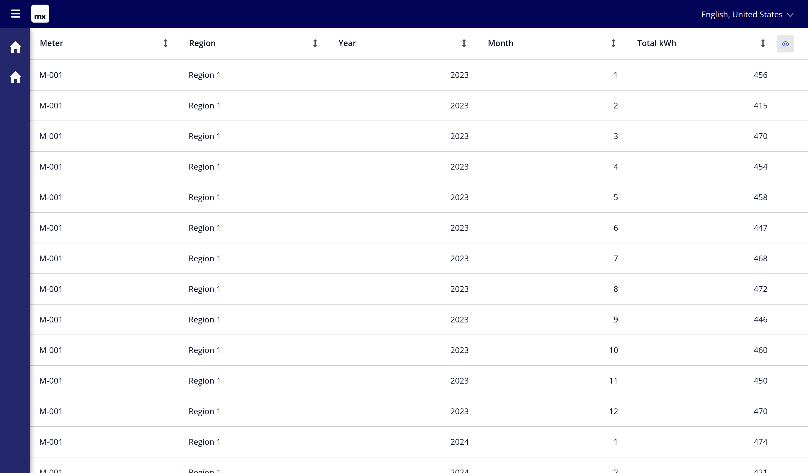

# 8. Shaping and composing view entities

The companion to [film 4](../video/view-entities-shaping.mp4). Everything here
was captured from the app in this repository on Mendix 10.24.24.119653.
The association parts need mxcli with
[ako/mxcli#452](https://github.com/ako/mxcli/pull/452) to reproduce — see
[FINDINGS 1](../FINDINGS.md).

## `cast`

`cast(x as string)` changes a value's type inside the query and compiles to a
plain SQL `CAST`. No join, no stored column, one expression in the select list.
It is what makes the enum-keyed resource in [example 1](01-the-constraint.md)
publishable:

```sql
,      cast(c.ContractType as string)  as ContractTypeKey     -- OQL
,      CAST("c"."contracttype" AS varchar) AS "ContractTypeKey"   -- SQL
```

**One rule comes with it.** A pass-through column keeps its own length; a
**derived** column — a cast, a concatenation, a `case` — is `String(200)`, the
platform default. Declaring anything else is caught as `MDL031` before the
build, and by MxBuild afterwards as `CE6770 View Entity is out of sync with the
OQL Query` ([`errors-shaping.txt`](errors-shaping.txt)).

## Two ways to carry a reference

A view entity row usually needs to say *which* thing it came from. There are
two shapes, and they cost different things.

### The association

Select the target's **id** under an alias. The alias becomes the association's
name, and the id column is **not** one of the declared attributes — there is no
second statement, because the column is the declaration
([`mdl/30-view-entity-association.mdl`](../mdl/30-view-entity-association.mdl)):

```sql
create or modify view entity Trends.MeterMonthRefVE (
  PeriodYear: Integer, MonthNo: Integer, TotalKwh: Decimal    -- three attributes
) as (
  select m.ID as MeterRef                                     -- four columns
  ,      datepart(YEAR, r.ReadAt)  as PeriodYear
  ,      datepart(MONTH, r.ReadAt) as MonthNo
  ,      sum(r.Kwh)                as TotalKwh
  from   Trends.Reading as r
    inner join r/Trends.Reading_Meter/Trends.Meter as m
  group by m.ID, datepart(YEAR, r.ReadAt), datepart(MONTH, r.ReadAt)
);
```

```
$ mxcli exec mdl/30-view-entity-association.mdl -p ViewEntityExamples.mpr
Created view entity: Trends.MeterMonthRefVE
Created view association: Trends.MeterRef -> Trends.Meter
```

It behaves like any other reference — this grid reads two of its five columns
over it:



**What it costs** ([`sql/11-association-retrieve.sql`](sql/11-association-retrieve.sql)):

```sql
-- 1. the view. Note what is missing: no join to trends$meter.
SELECT ..., "Trends.MeterMonthRefVE"."MeterRef"
FROM ( SELECT "r"."trends$reading_meter" AS "MeterRef", ...
       FROM "trends$reading" "r"
       GROUP BY "r"."trends$reading_meter", ... ) "Trends.MeterMonthRefVE"

-- 2. and then the meters, for the rows on screen
SELECT "id", "metercode", "region" FROM "trends$meter"
WHERE "trends$meter"."id" IN (?,?,?,?,?,?,?,?,?,?,?,?,?,?,?)
-- params 1-15: the same id, fifteen times        -- 1 row came back
```

Three things to read off that:

- **The view's own query got simpler.** `m.ID` compiled to
  `r."trends$reading_meter"` — the foreign key the reading already carries — so
  there is no join to the meter table at all.
- **It is a second round trip, batched per page.** Not one query per row: the
  runtime collects the page's references into one `IN (…)`. The list is not
  deduplicated, though — fifteen rows of one meter sent the same id fifteen
  times to fetch one row, and the list grows with the page size.
- **It materialises objects.** Those are real `Trends.Meter` objects in the
  client's state, with an object's lifetime. The view entity's own rows are not.

### The id as a string

[`mdl/31-id-as-string.mdl`](../mdl/31-id-as-string.mdl) carries the same
reference flat:

```sql
select cast(m.ID as string) as MeterId, m.MeterCode as MeterCode, ...
```

One statement, one join, no second retrieve, nothing materialised. What comes
back is Mendix's own object id as text — still enough to retrieve the real
object when something needs it:

```json
{ "meterId": "18577348462903560", "periodYear": 2023,
  "monthNo": 10, "meterCode": "M-002", "totalKwh": 522.0 }
```

### Choosing

| | association | id as string |
|---|---|---|
| statements per page | 2 | **1** |
| the view's own SQL | no join | one join |
| objects in the client | one per distinct target | **none** |
| read fields off the target | yes, directly | only after retrieving it |

A screen that shows the meter's code and region wants the association: those
columns come for one extra statement. A screen that only groups, filters or
links by meter wants the string, and stays one statement wide.

## Composing

A view entity can read another view entity
([`mdl/22-composed-view.mdl`](../mdl/22-composed-view.mdl)). `MeterYearVE`
reads `MeterMonthVE` and never mentions `Trends.Reading`:

```sql
select v.MeterCode as MeterCode, v.PeriodYear as PeriodYear
,      sum(v.TotalKwh) as TotalKwh, count(v.MonthNo) as MonthsCovered
,      max(v.TotalKwh) as BusiestMonthKwh
from   Trends.MeterMonthVE as v
group by v.MeterCode, v.PeriodYear
```

18 rows — 6 meters × 3 years. `BusiestMonthKwh` is a **max of sums**, which is
only expressible because the month view exists.

Underneath it is still one statement, nested twice
([`sql/13-composed-view.sql`](sql/13-composed-view.sql)): your view entity is a
subquery, and the one it reads is a subquery inside that. The inner view does
not know it is being read, and nothing about it changed when the outer one was
written.

The plan stacks the two groupings
([`sql/14-plan-composed.txt`](sql/14-plan-composed.txt)):

```
Limit (actual rows=18)
  -> HashAggregate (actual rows=18)                 <- the year view
       -> HashAggregate (actual rows=216)           <- the month view
            -> Hash Join (actual rows=6570)
Execution Time: 5.627 ms
```

**And a filter on the outer view still reaches the bottom** — the question that
decides whether composing is safe:

```
Limit (actual rows=3)                               -- WHERE MeterCode = 'M-004'
  -> GroupAggregate (actual rows=3)
       -> GroupAggregate (actual rows=36)
            -> Hash Join (actual rows=1095)
                 -> Hash -> Bitmap Index Scan on idx_trends$meter_metercode_asc
Execution Time: 1.664 ms
```

1095 readings, 36 months, 3 years — against 6570, 216 and 18. The predicate
travelled through **both** groupings to the index on the meter table.

## Where it stops

- **Levels are not free.** Each one is another grouping the planner keeps.
  Cheap here at three levels over 6570 rows; measure before assuming at thirty
  times that.
- **`order by` needs `limit`** (`MDL030`). A sorted view entity is a *top-N*
  view, not a sorted list — leave sorting to the page unless the cut is the
  point.
- **An alias cannot collide with an entity name** in the module,
  case-insensitively: `as meter` beside `Trends.Meter` gives *"Duplicate name
  'Meter' in module 'Trends'"*.
