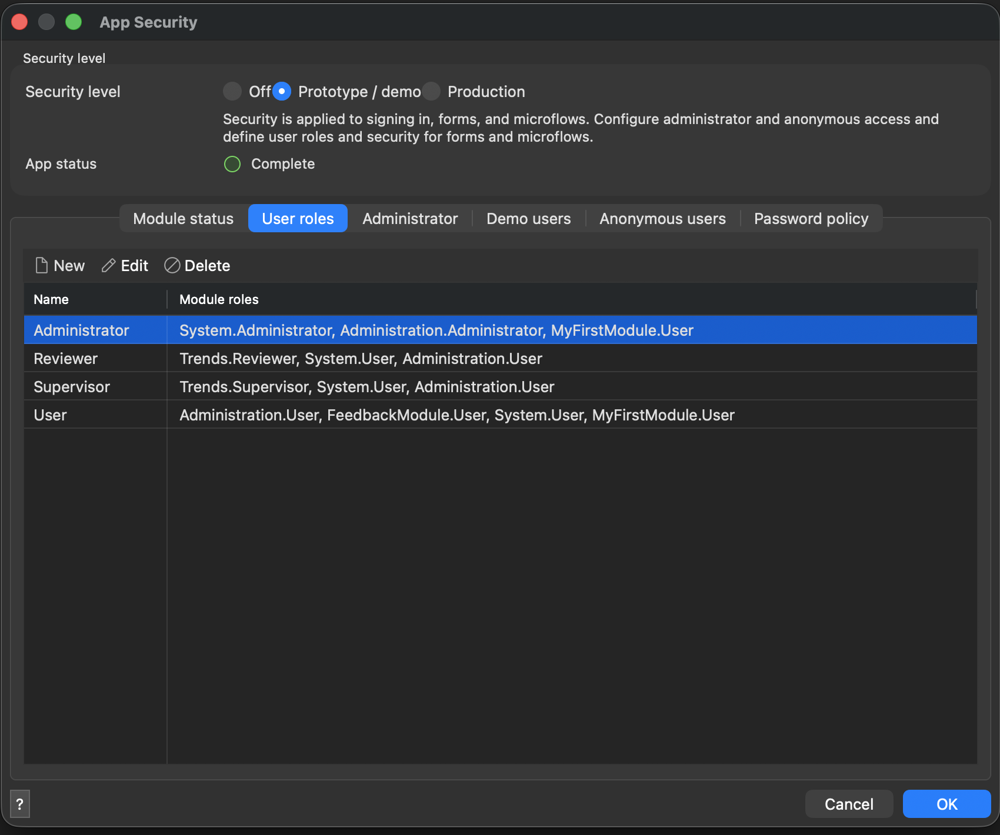

# Why workflows exist

*Mendix 11.14.0, in [`app-workflow/`](../app-workflow). Every log line, row and
activity record below was captured from it running; the captures are in
[`docs/workflow/`](workflow).*

A microflow is one transaction. It starts, does the work, commits, and is gone —
all of it, or none of it. That is exactly what you want for a calculation, and
it is useless for a process, because a process waits: for a person to come back
from lunch, for a manager on holiday, for a meter to be read again next Tuesday.
You cannot hold a transaction open for three days.

So the waiting has to live somewhere. Built by hand it lives in a `Status`
attribute, a page filtered on it, and a microflow for each move — which works,
and which thousands of Mendix apps run on. What it cannot answer is: who has
this one now, how long has it been sitting there, what happened before, and what
*is* the process — because the process exists only as the set of microflows that
happen to change that attribute.

A workflow is that process drawn once, and executed by an engine that keeps its
place. The drawing is the **definition**; each thing going through it is an
**instance**.

## The case

Six meters, three years of daily readings, and one reading three times its
neighbours:

```
| ReadAt                       | Kwh |
| Mon Mar 10 00:00:00 UTC 2025 | 23  |
| Tue Mar 11 00:00:00 UTC 2025 | 62  |
| Wed Mar 12 00:00:00 UTC 2025 | 25  |
```

No query can decide whether that is a broken meter or a cold week. A person has
to look — and that is the line between what a microflow can finish and what a
workflow is for.

## Where the instance actually is

An instance is rows. `ACT_StartCheck` calls the workflow and returns
immediately; what it leaves behind is this:

```
| Instance          | State      | Definition          |
| 13510798882111622 | InProgress | Trends.CheckReading |

| Task              | State      | Name                       |
| 14918173765664919 | InProgress | Review the flagged reading |
```

Stop the app. Start it again. Same ids, same state, same open task
([`03-restart.txt`](workflow/03-restart.txt)). That is the thing the status
attribute was pretending to be.

## Security, because a process without users is not a process

`app/` runs with security off — that is why every OData request in this repo
needs no credentials. This app cannot: half of what follows is about who can see
a task and who has claimed it. Hence a second app, at **Prototype / demo**,
with two roles and two users
([`mdl/workflow/45-security.mdl`](../mdl/workflow/45-security.mdl)).



The two role names are load-bearing: the user tasks target on
`System.UserRoles/System.UserRole/Name`, so renaming one here means the task
silently reaches nobody. The demo users are `reviewer` / `ReviewThis123` and
`supervisor` / `SuperviseIt123`
([`wf-demo-users.png`](../video/shots/wf-demo-users.png)).

## The five pieces, and what each is for

| | |
|---|---|
| **Context entity** | What one instance is about. Must be persistent — the instance outlives the request that started it. |
| **User task** | A page plus a list of outcomes. The outcomes are the branches. |
| **Targeting** | Who *sees* the task. Not who has it. |
| **Decision** | An expression over `$WorkflowContext`, case-sensitive from 11.9 on. |
| **Boundary timer** | The thing no microflow can do: wake the process up three days later. |

## Targeting is not assignment

This one costs everybody an afternoon. `targeting xpath` decides who the task
shows up for. It does not assign it, and **completing a task nobody has claimed
fails quietly** — the button appears to do nothing:

```
2026-09-13 08:40:54.153 ERROR - Client: You can't complete this user task,
it is not assigned to you.
```

`mx check` and the build both pass. `mxcli check` does warn
(**MDL-WORKFLOW10**). Claiming is a plain write, and it comes first:

```sql
change $Task (System.WorkflowUserTask_Assignees = [%CurrentUser%]);
commit $Task;
set task outcome $Task 'Accept';
```

## One run, start to finish

Two people, four buttons, minutes apart — and the engine keeping the place in
between ([`08-full-run.txt`](workflow/08-full-run.txt)):

```
08:51:24 | Start                          | Finished |
08:51:24 | Review the flagged reading     | Finished | Accept
08:51:24 | (boundary timer)               | Aborted  |
08:51:38 | Decision                       | Finished | true
08:51:38 | ACT_NotifyOwner                | Finished |
08:51:38 | Countersign a large correction | Finished | Accept
08:52:22 | ACT_LogOutcome                 | Finished |
08:52:22 | End                            | Finished |
```

Nobody wrote that table. It is what the process leaves behind by being a
process, and it is the whole argument for using one.

## The timer, with nobody logged in

Filmed at 60 seconds rather than three days; nothing else changed
([`05-timer.txt`](workflow/05-timer.txt)):

```
08:53:45 | (boundary timer)           | Finished
08:54:45 | ACT_Escalate               | Finished
08:54:45 | Review                     | Finished     <- the jump
08:54:45 | Review the flagged reading | Suspended    <- a fresh task, fresh timer
```

The task that was waiting is **Aborted** — that is what *interrupting* means.

## What this example does not do, and why

Two shapes built cleanly and did nothing at runtime, and both are fixed in
[ako/mxcli#457](https://github.com/ako/mxcli/pull/457) — verified here, in
[`FINDINGS.md`](../FINDINGS.md) §6–8 and
[`11-pr457-verification.txt`](workflow/11-pr457-verification.txt).

- **A parallel split ran both paths empty.** The process here was designed with
  one — notify the owner *while* the supervisor reads it — and is sequential
  because of it. [`mdl/workflow/47-parallel-split.mdl`](../mdl/workflow/47-parallel-split.mdl)
  is the designed shape, kept separate because *writing* it needs a #457 build;
  once written, any mxcli reads it and any 11.x runtime runs it.
- **A boundary path could only end with a jump.** MDL had no end activity, so
  the escalation marks the check and puts the question back rather than ending
  the instance the way Studio Pro would. That shape is unchanged here, because
  putting the question back is a reasonable thing for it to do.

And one that is worse than either, because the app does not come up at all: a
**boundary timer that names no kind** stores a class no 11.x runtime has. Until
#457 it was the example in `mxcli syntax workflow boundary-event`
([`10-bare-boundary-timer.txt`](workflow/10-bare-boundary-timer.txt)).

I also recorded, beside the parallel split, that *activities after a user task
are unreachable*. **That was wrong**, and it was a misdiagnosis of the split:
the activities I could not find were inside its paths. They run — measured by
completing a real task as a real user, which is what the earlier probe could not
do. The retraction is in [`FINDINGS.md`](../FINDINGS.md) §7.

## When not to use one

Most logic still is not this. No person, no waiting, no branch anybody needs to
watch — that is a microflow, and a workflow around it is an engine with nothing
to do. Use one when the process has to survive somebody going home.
